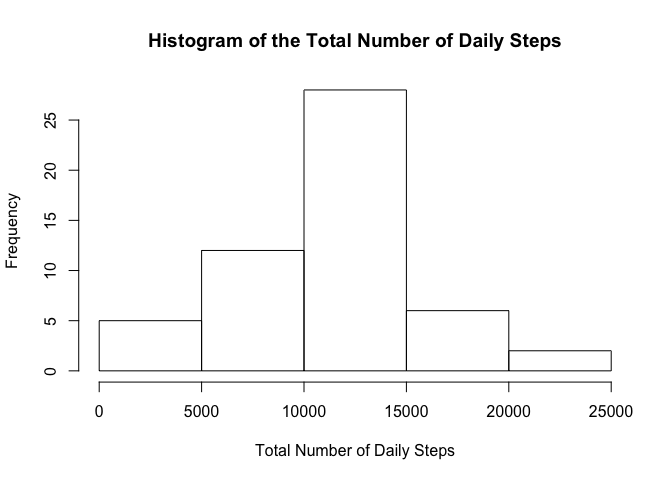
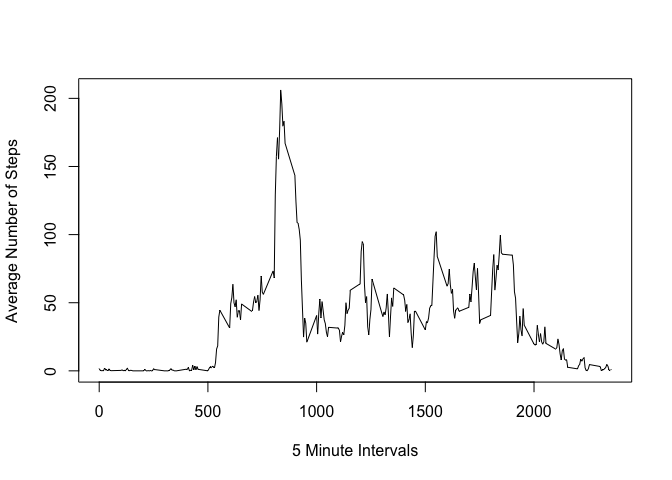
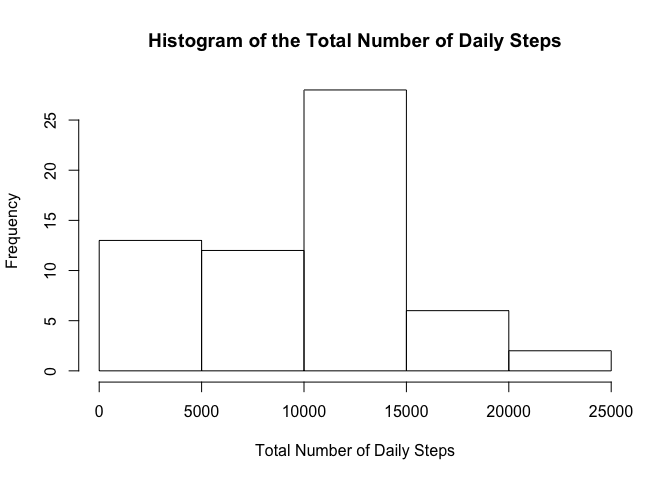
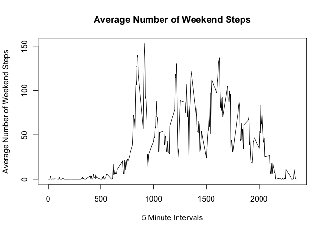
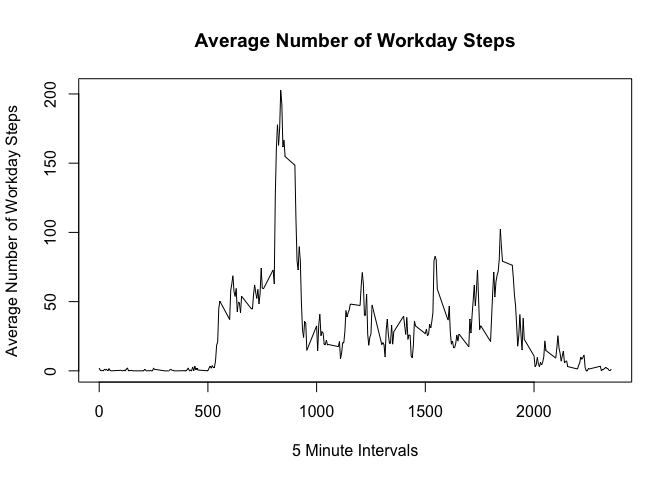

# Reproducible Research: Peer Assessment 1

## Loading and Preprocessing The Data
 
The data set is loaded as "Data" through the read.csv function. The date column was changed to the "date" class.


```r
Data <- read.csv("/Users/aweinste/Downloads/activity.csv")
Data$date <- as.Date(Data$date)
```

## What is the mean total number of steps taken per day?
To calculate the total number of steps taken per day, the aggregate function (utilizing "sum") was used. NAs were removed during the sum process. 

```r
DailyStepTotal <- with(Data, aggregate(steps, by = list(date), FUN = sum))
```

The total number of steps were then turned into a histogram.


```r
hist(DailyStepTotal$x, xlab = "Total Number of Daily Steps", main = "Histogram of the Total Number of Daily Steps")
```

<!-- -->

The mean and median of the total number of steps taken each day were calculated from the total number of daily steps.


```r
meanTotalSteps <- mean(DailyStepTotal$x, na.rm = TRUE)
meanTotalSteps
```

```
## [1] 10766.19
```

```r
medianTotalSteps <- median(DailyStepTotal$x, na.rm = TRUE)
medianTotalSteps
```

```
## [1] 10765
```

## What is the daily activity patern?
To calculate the average number of steps taken per interval, the aggregate function (utilizing "mean") was used.


```r
Intervals <- with(Data,(aggregate(steps, by = list(interval), FUN = mean, na.rm = TRUE)))
```

These interval averages are then plotted in a time series plot.


```r
plot(x = Intervals$Group.1, y = Intervals$x, type = "l",
     xlab = "5 Minute Intervals", ylab = "Average Number of Steps")
```

<!-- -->

Which 5 minute interval, on average across all days in the dataset, contains the most number of steps?

```r
Intervals[which.max(Intervals$x),]
```

```
##     Group.1        x
## 104     835 206.1698
```

## Inputing Missing Values
The total number of steps logged as NAs in the dataset are:


```r
sum(is.na(Data$steps))
```

```
## [1] 2304
```
Creating a new data set, called "newData" with all of the missing values filled in as "0"


```r
newData <- Data

newData$steps[is.na(newData$steps)] <- 0
```

Creating a histogram from this "newData" we can see the effects of NAs vs 0's

```r
noNADailyStepTotal <- with(newData,(aggregate(steps, by = list(date), FUN = sum)))

hist(noNADailyStepTotal$x, xlab = "Total Number of Daily Steps", main = "Histogram of the Total Number of Daily Steps")
```

<!-- -->

Calcuating the mean and median values of the NA replaced data set. 


```r
noNAMeanTotalSteps <- mean(noNADailyStepTotal$x, na.rm = TRUE)
noNAMeanTotalSteps
```

```
## [1] 9354.23
```

```r
noNAMedianTotalSteps <- median(noNADailyStepTotal$x, na.rm = TRUE)
noNAMedianTotalSteps
```

```
## [1] 10395
```

These numbers are significantly lower/ more spread out than the mean and median from the NA inclusive dataset. This makes sense because the data will be skewed to the right (more 0s means a longer tail to the left) making the mean and median further apart. 

## Are there differences in activity patterns between weekdays and weekends? 
First we have to add a layer of weekday labels using the weekdays() function. Subset the data based on if it is a weekday or weekend. Then aggregate the average of the data based on intervals. 


```r
weekdayLabel <- weekdays(newData$date)
weekdayLabel <- factor(weekdayLabel)
newData <- cbind(newData, weekdayLabel)


weekend <- subset(newData, weekdayLabel == "Saturday" | weekdayLabel == "Sunday")
workweek <- subset(newData, weekdayLabel != "Saturday" & weekdayLabel != "Sunday")

weekendSteps <- with(weekend, aggregate(steps, by = list(interval), FUN = mean))
workdaySteps <- with(workweek, aggregate(steps, by = list(interval), FUN = mean))
```

AND NOW WE PLOT


```r
plot(x = weekendSteps$Group.1, y = weekendSteps$x,type = "l",
     main = "Average Number of Weekend Steps",
     xlab = "5 Minute Intervals", ylab = "Average Number of Weekend Steps")
```

<!-- -->


```r
plot(x = workdaySteps$Group.1, y = workdaySteps$x,type = "l",
     main = "Average Number of Workday Steps",
     xlab = "5 Minute Intervals", ylab = "Average Number of Workday Steps")
```

<!-- -->
